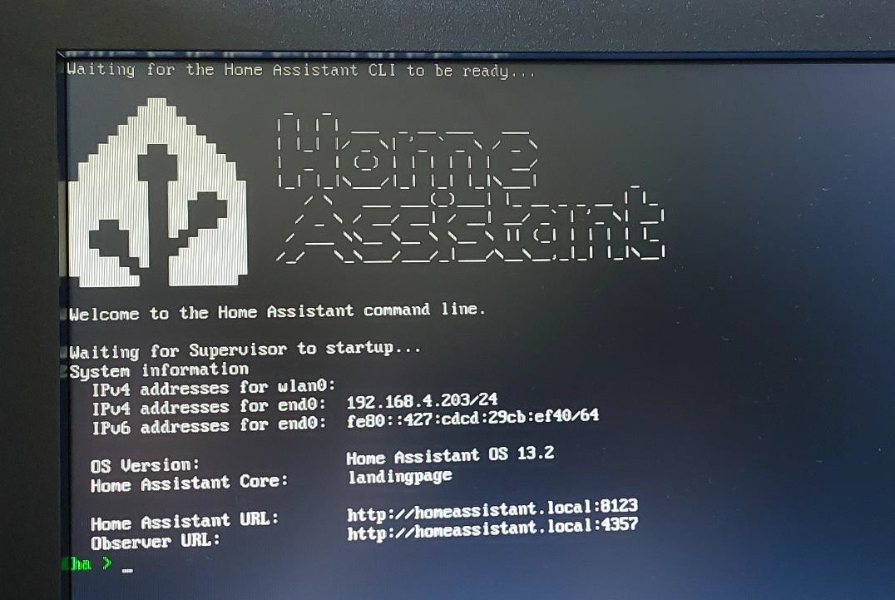

## 2. Instalación del software Raspberry Pi Imager ##

Raspberry Pi Imager es una herramienta que permite seleccionar e instalar sistemas
operativos directamente en una tarjeta SD (o dispositivo USB) para poder utilizarlo en una
Raspberry. Para iniciar la instalación, nos dirigimos a la página web oficial de Raspberry:

```
https://www.raspberrypi.com/software/(https://www.raspberrypi.com/software/)
```

- 1. En la pantalla de inicio nos encontraremos un instalador, tendremos que seleccionar el link
de descarga correspondiente al sistema operativo de nuestro PC. En nuestro caso Windows.

- 2. Una vez descargado el archivo .exe lo abrimos y vamos siguiendo los pasos indicados por el
programa de instalación (Pulsar el botón INSTALL y por último FINISH).

(*) Antes de continuar la instalación, debemos tener una tarjeta SD en el dispositivo que tiene
instalado el programa de Raspberry Pi Imager, será la forma de transportar los programas a
nuestra Raspberry.

- 3. Una vez instalado y conectada la tarjeta SD, ejecutamos el programa.

- 4. En la pestaña emergente, seleccionamos el nombre del dispositivo en el que vamos a instalar los programas,
en este caso utilizaremos la Raspberry pi 5. A continuación, seleccionaremos el Sistema
Operativo, para ello pulsaremos en el botón de ELEGIR SO y seguiremos la ruta:
```
Other specific-purpose OS →^ Home Assistant and home automation →^ Home Assistant^
y seleccionamos el Home Assistant que aparece en la lista.
```

- 5. En el apartado de almacenamiento, deberemos seleccionar nuestra tarjeta SD previamente
introducida en nuestro ordenador. Pulsamos siguiente y seguimos los pasos de instalación.


- 6. Al final del proceso nos mostrará la información en una nueva pestaña.

- 7. Conectamos la tarjeta a la Raspberry Pi y la iniciamos. Deberíamos esperar a que la
configuración se complete. Una vez configurada, si conectamos la Raspberry a una pantalla
debería aparecernos algo similar a esto, con la información del dispositivo en Home Assistant.



- 8. Por último, desde Home Assistant, instalamos los complementos que necesitemos. En
nuestro caso ESPHome, Grafana, InfluxDB y Node-Red.