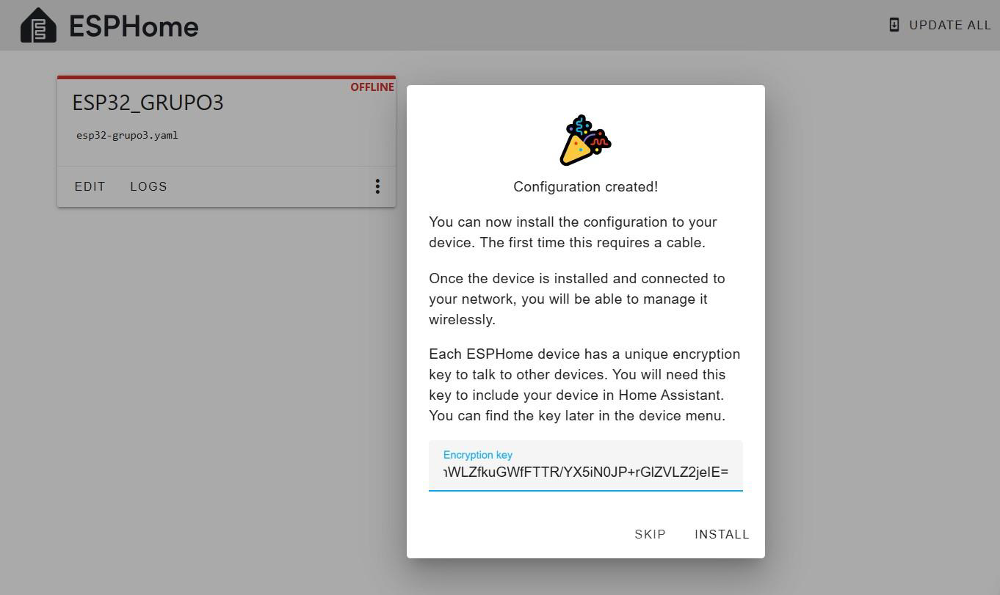
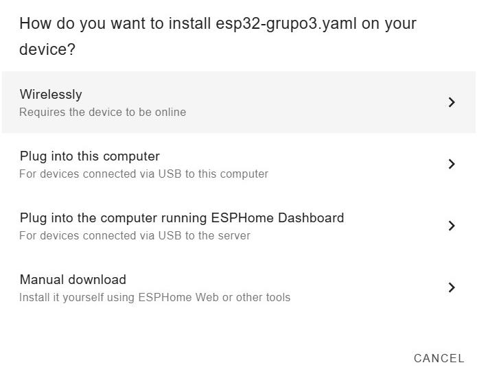
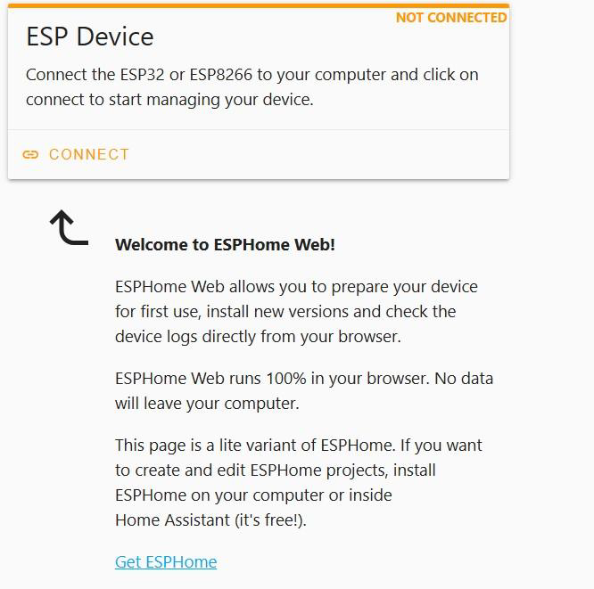
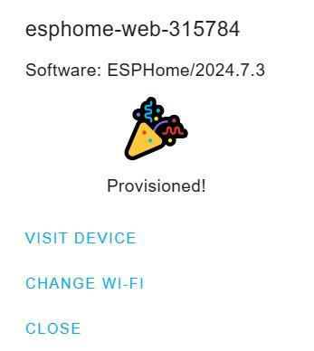
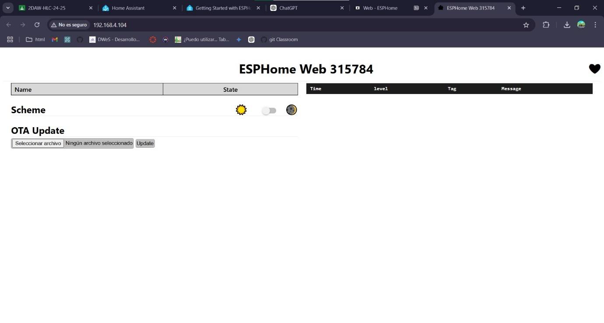

## 3. Configuración de ESP-32 y ESPHome ## 

Para configurar la ESP32 el primer paso será iniciar ESP Home y entrar en la interfaz gráfica.

Desde Home Assistant, abrimos la pestaña de ESPHome y pulsamos en `Nuevo Dispositivo → Ventana nueva`. 
En esta ventana podremos configurar el nombre de nuestro dispositivo.
Cuando lo hayamos introducido pulsamos Next.

A continuación pulsamos en los tres puntos que podemos ver en la esquina de la pantalla,
seleccionamos `Install → Plug into this computer`. 

Elegimos nuestro dispositivo de la lista y seguimos los pasos.

Cuando terminemos la configuración del dispositivo saltará una ventana emergente como la
siguiente, indicando la clave de encriptación. Pulsamos en `Install`:

Seguimos los pasos marcados por la ventana de instalación. Cuando la misma avance,
deberemos especificar cómo queremos instalar el archivo `.yaml` en el dispositivo. Este tipo de archivos almacenan la configuración, definición de infraestructura y gestión de datos de un programa. 
Para esta instalación el archivo .yaml contendrá las especificaciones para la instalación y configuración de nuestro ESP- 3 2. En este caso, lo instalaremos de forma manual:

En cuanto a la versión a descargar, elegimos `Factory format`, ya que es la opción más adecuada para configurar un equipo de ESPHome por primera vez *(o reinstalar el firmware desde cero)*:

(^)
Para continuar con la instalación, debemos entrar en la web de ESPHome. Si aún no hemos
entrado nunca, podemos encontrarla fácilmente buscando en Google, ya que nos saldrá como
primera opción. En la pantalla principal debemos ver lo siguiente:

Pulsamos en Connect para vincular nuestro dispositivo y mostrarlo en ESPHome.

En la ventana emergente seleccionamos nuestra ESP-32, que tenemos conectada por USB
a nuestro PC con el cable de alimentación. Una vez encontrado y seleccionado el ESP- 32
pulsamos Conectar.

Podemos comprobar que está conectado en la parte superior derecha `(CONNECTED)`.
En cuanto a las tres opciones que aparecen debajo del dispositivo ESP:

- **Prepare for first use** se utiliza para iniciar los pasos iniciales para el uso de ESP- 32 en
    caso de que el dispositivo no se haya configurado completamente.
- **Install** sirve para añadir algún software o firmware adicional para agregar nuevas
    funcionalidades o actualizar el sistema una vez configurado.
- **Logs** permite acceder a los archivos que contienen información del funcionamiento del
    dispositivo. Puede ser útil para diagnosticar problemas o hacer un seguimiento de su
    actividad.

En este caso seleccionaremos `prepare for first use` para proceder con la configuración del
dispositivo por primera vez.

Al pulsar saltará la siguiente ventana para continuar con la instalación. Deberemos seleccionar el archivo con extensión .factory que contiene la configuración del dispositivo para traspasar esta información a ESP-32. Si estuviésemos configurando una extensión o actualizando el programa ya existente utilizaríamos la opción OTA, con la documentación correspondiente:

``
*(Antes de pulsar instalar comprobar que ESP-32 está conectado a la red.)*
``

Una vez hayamos seleccionado el archivo, pulsamos `Install`.

En la siguiente ventana seleccionaremos la opción de `Connect to wi-fi` e ingresaremos los datos de la red (SSID y contraseña). Una vez comprobados los datos guardamos la configuración.

Cuando la instalación esté completa debería salir un mensaje como el siguiente que indica que el dispositivo está listo para ser utilizado en ESPHome:

Si entramos en el host proporcionado dentro del archivo de configuración .factorydesde un navegador podremos ver la interfaz gráfica donde se está ejecutando ESPHome:

En esta interfaz podremos monitorizar los sensores que instalaremos a continuación en la parte derecha de la pantalla.